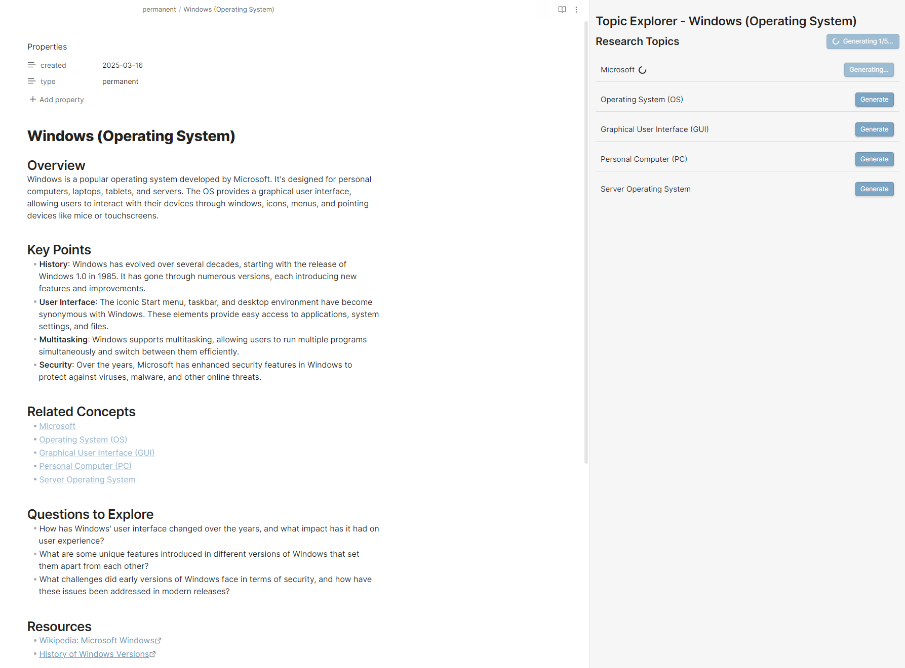

# Topic Explorer for Obsidian

## Overview

Topic Explorer is an Obsidian plugin that helps you learn topics deeply by generating structured notes with properly formatted "dead links" to related concepts that you can progressively explore. It enhances your knowledge management workflow by identifying, normalizing, and generating content for wikilinks in your notes.

## Key Features

### Dead Link Detection and Management

- **Automatic Detection**: Identifies wikilinks in your notes that don't have corresponding files
- **Sidebar Integration**: View all dead links in the current note through a convenient sidebar
- **Batch Generation**: Create multiple notes at once with the "Generate All" button

### Link Normalization

- **Consistent Formatting**: Automatically capitalize and singularize links for a standardized vault
- **One-Click Application**: Apply normalizations individually or all at once
- **Preview Changes**: See how links will be normalized before applying changes

### AI-Powered Note Generation

- **Structured Templates**: Generate comprehensive, well-organized notes for any topic
- **Local AI Integration**: Connect to Ollama for private, local content generation
- **Customizable Output**: Adjust generation parameters like temperature and token count

### Seamless Obsidian Integration

- **Respects Obsidian Settings**: Uses your configured new note location by default
- **Sidebar View**: Access all functionality through a dedicated sidebar
- **Command Palette Support**: Quick access through Obsidian's command palette

## Use Cases

### Research and Study

- **Literature Review**: Quickly create structured notes for new concepts you encounter
- **Study Preparation**: Generate comprehensive topic overviews before diving into details
- **Knowledge Gaps**: Identify and fill gaps in your understanding by exploring dead links

### Writing and Content Creation

- **Outline Expansion**: Turn simple outlines with wikilinks into fully-developed content
- **Concept Development**: Explore related ideas by following the trail of generated links
- **Consistent Structure**: Maintain uniform note formatting across your entire vault

### Knowledge Management

- **Zettelkasten Method**: Perfect companion for building a connected web of knowledge
- **Progressive Summarization**: Start with generated content and refine over time
- **Link Maintenance**: Keep your vault organized with consistent link formatting

## Getting Started

1. Install the plugin by cloning and building the project.

2. Configure basic settings:
   - Go to Settings → Topic Explorer
   - Choose your preferred link normalization options
   - Set your desired note location
   - Save changes

3. For AI-powered generation (optional):
   - Install Ollama on your system (<https://ollama.ai>)
   - Pull your preferred model (e.g., `ollama pull mistral`)
   - Enable Ollama integration in plugin settings
   - Configure the server URL and model settings

4. Start using Topic Explorer:
   - Open the Topic Explorer sidebar (click ribbon icon or use command palette)
   - Create a new note with some [[wikilinks]]
   - Use the sidebar to manage dead links and generate content
   - Apply link normalizations as needed

5. Access via Command Palette:
   - Press Cmd/Ctrl + P
   - Search for "Topic Explorer" to see available commands
   - Use shortcuts for quick access to common functions

## Configuration

### Link Normalization Options

- **Capitalize Links**: Automatically capitalize the first letter of each link
- **Singularize Links**: Convert plural forms to singular (e.g., "Cows" to "Cow")

### Note Location

- **Use Obsidian's Location**: Follow Obsidian's settings for where to create new notes
- **Custom Folder**: Specify a custom folder for all generated notes

### Ollama Integration (Optional)

- **Server URL**: Connect to your local Ollama server
- **Model Selection**: Choose which model to use for generation
- **Generation Parameters**: Fine-tune temperature, token count, and other settings

## Tips for Effective Use

- Start with a core concept and create links to related ideas
- Use the Topic Explorer to generate structured notes for these links
- Review and refine the generated content
- Continue exploring by generating content for the new links
- Periodically normalize links to maintain consistency

## Contributing

Contributions are welcome! Please feel free to submit a Pull Request.

---

*Topic Explorer helps you build a rich, interconnected knowledge base by making it easy to explore and document new concepts as you encounter them.*
